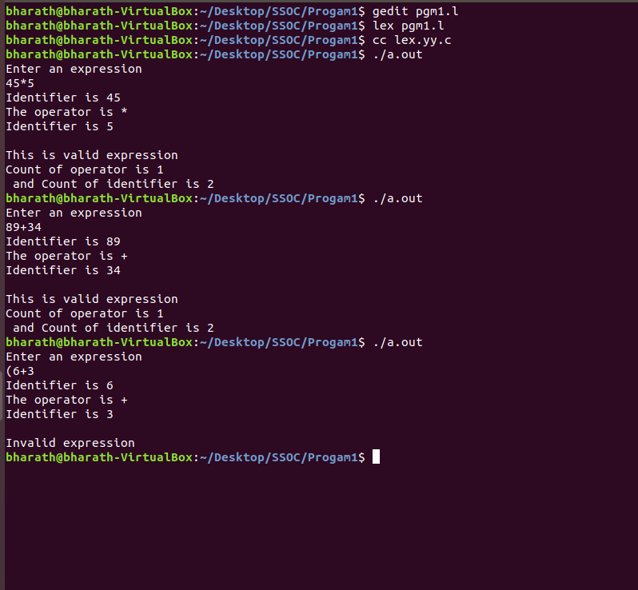

## Program 1a:
## Write a Lex program to recognize valid arithmetic expression. Identifiers in the expression could be only integers and operators could be + and *. Count the identifiers and operators present and print them separately.

## Output:
